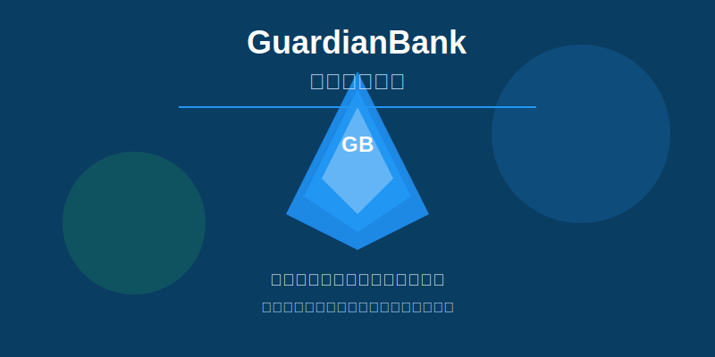
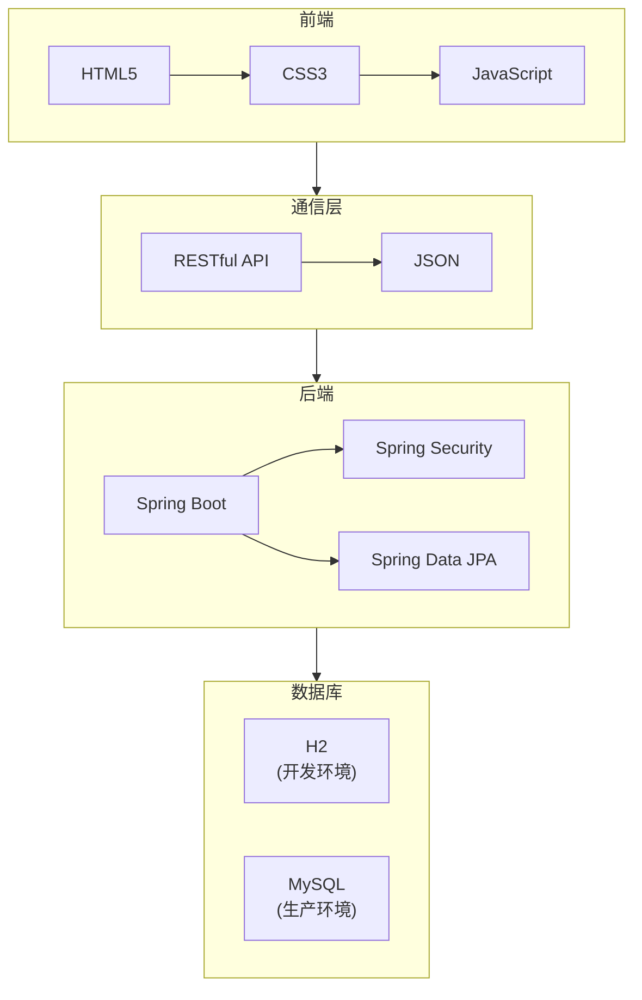

# GuardianBank 金融服务系统



## 🌟 项目亮点

  
  
 

## 项目简介

GuardianBank是一个**现代化金融服务系统**，采用前后端分离架构，提供完整的银行业务功能和用户服务。系统设计注重安全性、性能和用户体验，为用户提供便捷、可靠的金融服务解决方案。

- 🚀 **高效性能**：采用多种前端性能优化技术，包括资源懒加载、图片优化和请求缓存机制
- 🔒 **银行级安全**：实现严格的身份验证、授权和数据加密，保护用户信息安全
- 📱 **全平台兼容**：响应式设计确保在桌面、平板和移动设备上都有出色表现
- 🔄 **前后端分离**：后端基于Spring Boot提供RESTful API，前端采用HTML、CSS和JavaScript构建用户界面

系统已完成前端性能优化和全面测试工作，15个测试全部通过，显著提升了加载速度、运行效率和系统稳定性，为用户带来流畅可靠的体验。

## 项目结构

```
GuardianBank Program/
├── .gitignore              # Git忽略文件
├── README.md               # 项目说明文档
├── backend/                # 后端项目
│   ├── pom.xml             # Maven配置文件
│   ├── src/                # 源代码
│   │   └── main/
│   └── start-backend.bat   # Windows启动脚本
├── frontend/               # 前端项目
│   ├── app.js              # 应用入口及配置
│   ├── index.html          # 首页
│   ├── package.json        # npm配置
│   ├── server.js           # 前端服务器
│   ├── start-frontend.bat  # 前端启动脚本
│   └── styles.css          # 样式文件
├── project_status/         # 项目状态文档
│   ├── completed_tasks.md  # 已完成任务列表
│   └── pending_tasks.md    # 待完成任务列表
└── start-project/          # 项目启动脚本
    ├── README.txt          # 启动说明
    ├── start-project.bat   # Windows启动脚本
    └── start-project.ps1   # PowerShell启动脚本
```

关键目录说明：
- `backend/`：包含Spring Boot后端应用代码和构建配置
- `frontend/`：包含前端静态资源和配置
- `project_status/`：包含项目状态文档，记录已完成和待完成的任务
- `start-project/`：包含项目启动脚本，提供便捷的方式启动整个项目
- `start-*.bat`：平台特定的启动脚本
- `pom.xml`：Maven项目配置，已配置Spring Boot Repackage插件

## 系统架构

下面是GuardianBank金融服务系统的架构图，使用Mermaid语法绘制：



系统架构说明：
- **前端**：使用HTML5、CSS3和JavaScript构建响应式用户界面
- **通信层**：通过RESTful API进行前后端通信，数据格式采用JSON
- **后端**：基于Spring Boot框架，集成Spring Security提供安全认证，使用Spring Data JPA进行数据访问
- **数据库**：开发环境使用H2内存数据库，生产环境使用MySQL关系型数据库

## 技术栈

### 后端
  
  


### 前端
  
  

### 性能优化技术
- 图片懒加载
- JavaScript延迟加载
- CSS预加载
- 请求缓存机制
- 指数退避重试机制
- DOM操作优化 (文档片段)

## 功能特点

GuardianBank金融服务系统提供全方位的金融服务功能，满足用户多样化的需求：

### 👤 账户管理
- 用户注册、登录和身份验证
- 账户信息查询和管理
- 交易历史记录查询

### 💸 支付与转账
- 国内转账和国际汇款
- 支付账单和水电费
- 移动支付集成

### 📈 投资理财
- 定期存款和理财产品
- 股票和基金投资
- 投资组合管理

### 🏠 贷款服务
- 个人贷款和房屋抵押贷款
- 贷款申请和审批流程
- 利率计算和还款计划

### 📞 客户服务
- 在线客服支持
- 常见问题解答
- 投诉和反馈处理

### ⚡ 系统性能优化
- 图片懒加载：减少初始加载时间
- JavaScript延迟加载：提高页面渲染速度
- CSS预加载：优化样式加载顺序
- 请求缓存机制：减少重复网络请求
- 指数退避重试：提高API调用稳定性
- DOM操作优化：使用文档片段减少重排重绘

## 项目启动指南

### 🚀 快速启动

#### 使用批处理文件
```
cd d:\GuardianBank Program\start-project
start-project.bat
```

#### 使用PowerShell脚本
```
cd d:\GuardianBank Program\start-project
powershell -File .\start-project.ps1
```

### 🔧 手动启动步骤

#### 启动后端服务
```
cd d:\GuardianBank Program\backend
mvn clean package -DskipTests
cd target
java -jar guardianbank-backend-1.0.0.jar
```

#### 启动前端服务
```
cd d:\GuardianBank Program\frontend
npm install
npm start
```

### 🌐 服务访问地址
- 前端: http://localhost:3000
- 后端: http://localhost:8080

### 🔍 验证方法
1. 打开浏览器访问前端地址
2. 使用默认账户登录: `user` / `password`
3. 验证各项功能是否正常工作

### 注意事项
1. 第一次运行时，安装前端依赖可能需要一些时间
2. 如果遇到端口冲突，请修改后端或前端的配置文件
3. 服务会在新窗口启动，执行命令的窗口可以关闭

### 故障排除
- Maven或Node.js未找到: 请确保已安装并添加到环境变量
- 端口冲突: 尝试修改配置文件中的端口号
- 构建失败: 检查网络连接，确保依赖可以下载


2. **账户服务**：余额查询、交易记录、转账汇款
3. **服务展示**：展示银行提供的各种金融服务
4. **联系我们**：用户可以提交联系表单获取支持
5. **用户认证**：基于JWT的身份验证和基于角色的访问控制
6. **数据管理**：使用数据库存储和管理用户及服务信息
7. **跨域支持**：配置CORS以支持前后端分离开发
8. **安全防护**：密码加密、请求验证、防SQL注入

## 安装指南

### 前提条件
- JDK 17 或更高版本
- Maven 3.8 或更高版本
- Node.js 14 或更高版本 (前端运行)
- Git

### 后端安装
1. 克隆项目仓库：
   ```bash
   git clone https://github.com/CelestialVisionary/GuardianBank-Program.git
   cd guardianbank/backend
   ```
2. 构建项目：
   ```bash
   mvn clean package -DskipTests
   java -jar target\guardianbank-backend-1.0.0.jar
   ```

注意事项：
1. 如果遇到文件占用问题，先执行清理命令：
   ```bash
   rm -r target
   ```
2. PowerShell请使用分号分隔命令：
   ```powershell
   mvn clean package -DskipTests; java -jar target\guardianbank-backend-1.0.0.jar
   ```
3. 后端服务将在 http://localhost:8080 启动

### 前端安装
1. 进入前端目录：
   ```bash
   cd guardianbank/frontend
   ```
2. 安装依赖：
   ```bash
   npm install
   ```
3. 启动开发服务器：
   ```bash
   npm start
   ```
4. 前端页面将在 http://localhost:3000 访问

### 性能优化验证
启动服务后，您可以通过以下方式验证前端性能优化效果：
1. 打开浏览器开发者工具 (F12)
2. 切换到 Network 面板
3. 刷新页面，观察资源加载情况：
   - 图片将在进入视口时才加载 (懒加载)
   - JavaScript 文件将延迟加载 (defer 属性)
   - CSS 文件将被预加载 (preload)
4. 切换到 Performance 面板，记录页面加载性能，与优化前对比

## 配置说明

### 后端配置
- 开发环境配置：`src/main/resources/application.properties`
- 生产环境配置：`src/main/resources/application-prod.properties`

主要配置项：
```properties
# 服务器配置
server.port=8080
server.servlet.context-path=/

# 数据库配置
spring.datasource.url=jdbc:h2:mem:guardianbank
spring.datasource.driverClassName=org.h2.Driver
spring.datasource.username=sa
spring.datasource.password=

# JPA配置
spring.jpa.database-platform=org.hibernate.dialect.H2Dialect
spring.jpa.hibernate.ddl-auto=update

# H2控制台配置
spring.h2.console.enabled=true
spring.h2.console.path=/h2-console

# 日志配置
logging.level.root=INFO
logging.level.com.guardianbank=DEBUG
```

### 前端配置
- 配置文件：`frontend/app.js` (在实际项目中配置API基础URL)
- API 基础URL配置示例：
```javascript
const config = {
  apiBaseUrl: 'http://localhost:8080/api'
};
```


## 访问控制

系统支持三种用户角色：
- **访客**：可以浏览公开信息和服务
- **普通用户**：可以访问基本功能、查看服务信息和管理个人账户
- **管理员**：可以访问所有功能，包括管理服务、用户和系统配置

默认用户：
- 用户名: `user`, 密码: `password`, 角色: USER
- 用户名: `admin`, 密码: `password`, 角色: ADMIN


## 贡献指南

1. Fork 项目仓库
2. 创建功能分支: `git checkout -b feature/your-feature`
3. 提交更改: `git commit -m 'Add some feature'`
4. 推送到分支: `git push origin feature/your-feature`
5. 提交 Pull Request

## 代码规范

### 后端
- 遵循 Google Java Style Guide
- 类名使用驼峰命名法，首字母大写
- 方法名使用驼峰命名法，首字母小写
- 变量名使用驼峰命名法，首字母小写
- 常量名使用大写字母，下划线分隔
- 每个类和方法添加适当的Javadoc注释

### 前端
- 遵循 Airbnb JavaScript Style Guide
- 使用ES6+语法
- 变量名使用驼峰命名法，首字母小写
- 函数名使用驼峰命名法，首字母小写
- 类名使用驼峰命名法，首字母大写
- 每个组件和函数添加适当的注释

## 许可证

本项目采用 MIT 许可证 - 详情请见项目根目录的 LICENSE 文件

## 联系方式

- 项目负责人: [CelestialVisionary](mailto:zilvdebao@outlook.com)

## 鸣谢

感谢所有为项目做出贡献的团队成员和开源社区！

## 🚀 部署与贡献

### 🔄 部署到GitHub

#### 手动部署步骤
1. **在GitHub上创建新仓库**：登录GitHub，创建一个新的空仓库，获取仓库URL
2. **初始化本地Git仓库**（如项目未初始化）：
   ```bash
   git init
   ```
3. **添加所有文件到暂存区**：
   ```bash
   git add .
   ```
4. **提交初始更改**：
   ```bash
   git commit -m "初始提交：项目基础结构搭建"
   ```
5. **添加远程仓库**：
   ```bash
   git remote add origin https://github.com/CelestialVisionary/GuardianBank-Program.git
   ```
6. **推送代码到main分支**：
   ```bash
   git push -u origin main
   ```

#### 日常开发与推送流程
1. **更新本地代码**（从远程拉取最新更改）：
   ```bash
   git pull origin main
   ```
2. **开发功能或修复问题**后，添加更改：
   ```bash
   git add 更改的文件路径
   # 或添加所有更改
   git add .
   ```
3. **提交更改**（使用清晰描述性的提交信息）：
   ```bash
   git commit -m "功能/修复：具体描述"
   ```
4. **推送更改到远程**：
   ```bash
   git push origin main
   ```

### 🤝 贡献指南

1. **Fork 项目仓库**：点击GitHub页面上的"Fork"按钮
2. **创建功能分支**：
   ```bash
   git checkout -b feature/your-feature
   ```
3. **提交更改**：
   ```bash
   git commit -m 'Add some feature'
   ```
4. **推送到分支**：
   ```bash
   git push origin feature/your-feature
   ```
5. **提交 Pull Request**：在GitHub页面上创建新的Pull Request

### 注意事项
- 确保您已安装Git并配置了GitHub凭证
- 仓库URL：https://github.com/CelestialVisionary/GuardianBank-Program.git
- 推送前建议先拉取远程最新代码，避免冲突
- 遵循代码规范，确保代码质量
- 提交信息应清晰描述更改内容

## 💡 项目开发思路与仓库管理

### 🚀 开发思路
1. **前后端分离架构**：后端提供RESTful API，前端负责用户界面和交互，实现关注点分离
2. **迭代开发**：采用敏捷开发模式，分阶段实现功能，持续集成和测试
3. **模块化设计**：将系统拆分为多个功能模块（用户管理、账户服务等），提高代码可维护性
4. **安全性优先**：实现严格的身份验证、授权和数据加密，保护用户信息安全
5. **用户体验至上**：注重界面设计和交互体验，确保系统易于使用

### 🔄 仓库管理

#### 版本控制的重要性
- 📜 追踪代码变更历史，便于回滚和问题定位
- 👥 多人协作开发的基础，避免代码冲突
- 💾 代码的备份和安全保障

#### 分支策略
- `main`分支：稳定版本分支，仅包含经过测试的可发布代码
- 功能分支：为每个新功能创建独立分支（如`feature/user-management`），开发完成后合并到main
- 修复分支：为紧急bug修复创建分支（如`hotfix/login-issue`），修复后合并到main

#### 提交规范
- ✅ 提交信息应清晰描述更改内容（如`功能：添加用户注册接口`或`修复：登录页面表单验证问题`）
- 📝 保持提交粒度适中，每个提交对应一个完整的功能或修复

#### 代码审查
- 🔍 推行Pull Request流程，鼓励团队成员互相审查代码
- 🚀 通过代码审查提高代码质量，发现潜在问题和改进点